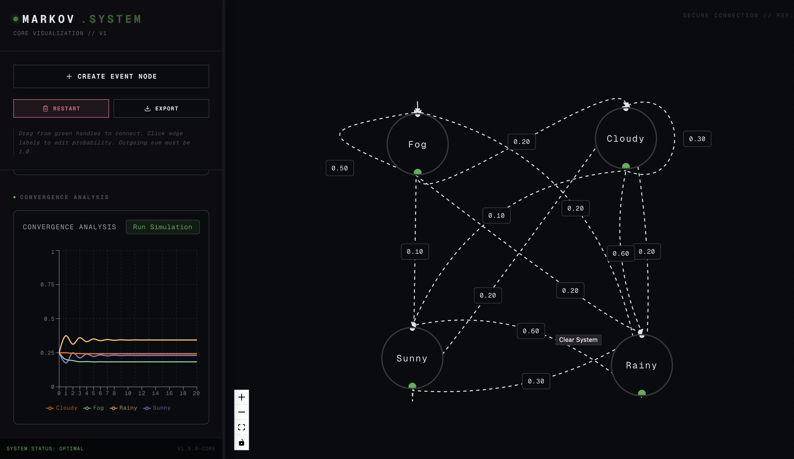
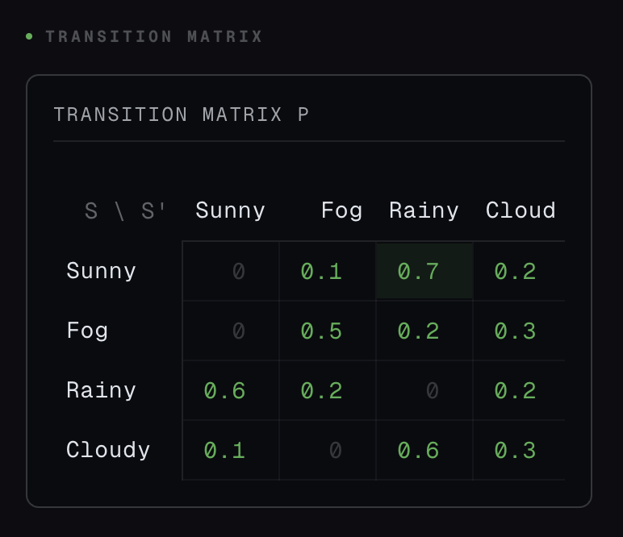

<div align="center">


# 🔗 Markov Chain System

_Interactive Markov Chain simulation & visualization platform_


<p>
    <a href="#chinese">中文</a> · <a href="#english">English</a>
</p>

</div>

---

<div id="chinese"></div>

## 📸 界面预览

<div align="center">



<p><em>▲ 主界面 — 拖拽式马尔可夫链编辑器</em></p>

</div>

<table>
  <tr>
    <td align="center" width="50%">
      
      <br /><em>转移概率矩阵</em>
    </td>
    <td align="center" width="50%">
      
      <br /><em>收敛分析图表</em>
    </td>
  </tr>
</table>

---

## ✨ 特性

| 功能 | 描述 |
|:---:|:---|
| 🖱️ **可视化编辑** | 拖拽节点、连线创建状态转移图 |
| 📊 **实时矩阵** | 自动生成并展示转移概率矩阵 |
| 📈 **收敛分析** | 模拟多步迭代，直观展示状态分布收敛过程 |
| ✅ **概率验证** | 自动校验每行转移概率之和是否为 1.0 |
| 💾 **导入/导出** | 支持 JSON 格式保存与加载系统状态 |
| 🎨 **Retro-Futuristic** | 复古未来主义 UI 风格 |

---

## 🏗️ 架构

```
markovsystem/
├── backend/          ← Python 核心计算引擎
│   ├── app.py              Flask API 入口
│   ├── markov_system.py    系统主控 · 矩阵运算 · 模拟
│   ├── event.py            状态节点定义
│   └── transition.py       转移边定义
├── frontend/         ← Next.js 可视化界面
│   └── src/
│       ├── app/            页面路由 & 布局
│       ├── components/     React Flow 画布 & 图表组件
│       └── store/          Zustand 全局状态管理
├── media/            ← 项目截图
└── start.sh          ← 一键启动脚本
```

---

## 🚀 快速开始

### 一键启动

```bash
chmod +x start.sh && ./start.sh
```

> 自动启动后端 (`:5001`) + 前端 (`:3000`)，并打开浏览器。

### 分别启动

<details>
<summary><b>后端 (Flask API)</b></summary>

```bash
cd backend
python3 -m venv venv
source venv/bin/activate
pip install -r requirements.txt
flask run --port=5001
```

</details>

<details>
<summary><b>前端 (Next.js)</b></summary>

```bash
cd frontend
npm install
npm run dev
```

打开 [http://localhost:3000](http://localhost:3000)

</details>

### Python 直接调用

```python
from backend.markov_system import MarkovSystem

system = MarkovSystem()
system.add_event("1", "Event A")
system.add_event("2", "Event B")
system.add_transition("t1", "1", "2", 1.0)
system.add_transition("t2", "2", "1", 1.0)

errors = system.validate()
if not errors:
    steps, distributions = system.simulate(10)
    print(distributions)
```

---

## 🛠️ 技术栈

<table>
  <tr>
    <th align="center">层级</th>
    <th align="center">技术</th>
    <th align="center">用途</th>
  </tr>
  <tr>
    <td align="center"><b>Backend</b></td>
    <td>Python · Flask</td>
    <td>马尔可夫链核心算法 & REST API</td>
  </tr>
  <tr>
    <td align="center"><b>Frontend</b></td>
    <td>Next.js · TypeScript · Tailwind CSS</td>
    <td>响应式 Web 界面</td>
  </tr>
  <tr>
    <td align="center"><b>Graph</b></td>
    <td>React Flow</td>
    <td>交互式状态转移图绘制</td>
  </tr>
  <tr>
    <td align="center"><b>Charts</b></td>
    <td>Recharts</td>
    <td>收敛曲线 & 数据可视化</td>
  </tr>
  <tr>
    <td align="center"><b>State</b></td>
    <td>Zustand</td>
    <td>前端全局状态管理</td>
  </tr>
</table>

---

<div id="english"></div>

## 📸 Screenshots

<div align="center">


<p><em>▲ Main Interface — Drag-and-drop Markov Chain Editor</em></p>

</div>

<table>
  <tr>
    <td align="center" width="50%">
      
      <br /><em>Transition Probability Matrix</em>
    </td>
    <td align="center" width="50%">
      
      <br /><em>Convergence Analysis Chart</em>
    </td>
  </tr>
</table>

---

## ✨ Features

| Feature | Description |
|:---:|:---|
| 🖱️ **Visual Editor** | Drag-and-drop nodes and edges to build state transition graphs |
| 📊 **Live Matrix** | Auto-generated transition probability matrix |
| 📈 **Convergence** | Multi-step simulation with distribution convergence visualization |
| ✅ **Validation** | Automatic row-sum probability check (= 1.0) |
| 💾 **Import/Export** | Save & load system state as JSON |
| 🎨 **Retro-Futuristic** | Minimalist retro-futuristic UI aesthetic |

---

## 🚀 Quick Start

### One-Click Launch

```bash
chmod +x start.sh && ./start.sh
```

> Auto-starts backend (`:5001`) + frontend (`:3000`) and opens browser.

### Manual Setup

<details>
<summary><b>Backend (Flask API)</b></summary>

```bash
cd backend
python3 -m venv venv
source venv/bin/activate
pip install -r requirements.txt
flask run --port=5001
```

</details>

<details>
<summary><b>Frontend (Next.js)</b></summary>

```bash
cd frontend
npm install
npm run dev
```

Open [http://localhost:3000](http://localhost:3000)

</details>

### Python API Usage

```python
from backend.markov_system import MarkovSystem

system = MarkovSystem()
system.add_event("1", "Event A")
system.add_event("2", "Event B")
system.add_transition("t1", "1", "2", 1.0)
system.add_transition("t2", "2", "1", 1.0)

errors = system.validate()
if not errors:
    steps, distributions = system.simulate(10)
    print(distributions)
```

---

## 🛠️ Tech Stack

<table>
  <tr>
    <th align="center">Layer</th>
    <th align="center">Technology</th>
    <th align="center">Purpose</th>
  </tr>
  <tr>
    <td align="center"><b>Backend</b></td>
    <td>Python · Flask</td>
    <td>Markov Chain core algorithms & REST API</td>
  </tr>
  <tr>
    <td align="center"><b>Frontend</b></td>
    <td>Next.js · TypeScript · Tailwind CSS</td>
    <td>Responsive web interface</td>
  </tr>
  <tr>
    <td align="center"><b>Graph</b></td>
    <td>React Flow</td>
    <td>Interactive state transition graph</td>
  </tr>
  <tr>
    <td align="center"><b>Charts</b></td>
    <td>Recharts</td>
    <td>Convergence curves & data visualization</td>
  </tr>
  <tr>
    <td align="center"><b>State</b></td>
    <td>Zustand</td>
    <td>Frontend global state management</td>
  </tr>
</table>

---
